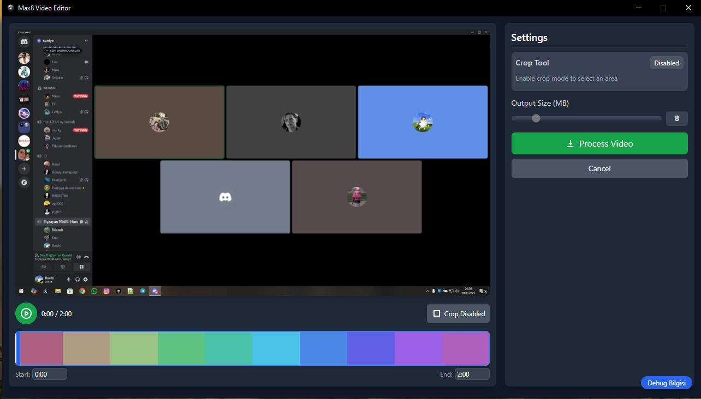

# 8MB Video Converter

A tool that compresses your Discord videos below 8MB. Simply drag and drop a video and it will be compressed.

Not just 8MB, you can adjust the size as you wish.

You also have the ability to quickly crop your videos.

